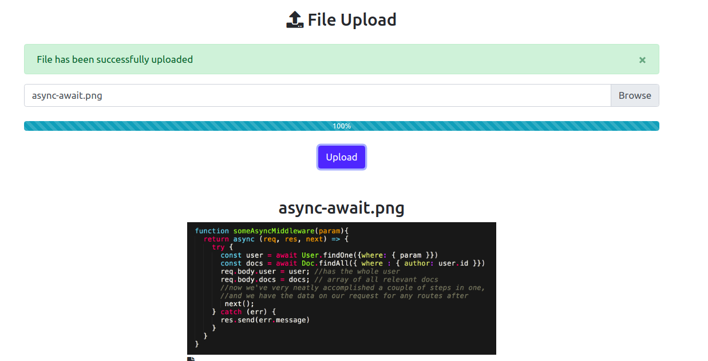

# FILEUPLOAD

    A file upload app with view at cleint side using react, express and nodejs



## About

FILEUPLOAD is an application, where a user can upload multiple file to server and view at client side.

## Features

- Multiple file upload at client side using react.
- Upload file can view at server side using express.
- Styling with fontawesome & bootstrap.
- Validation with proper failure and success message.
- Fileupload and more...

## Getting started

```
use node 12.2.0 or greater
git clone https://github.com/HimanshuP90/fileUpload.git 
cd fileUpload
npm install
cd client
npm install
then back to fileupload folder and run below
npm run dev

```

Then auto redirected in  `http://localhost:3000/` to see your app.
